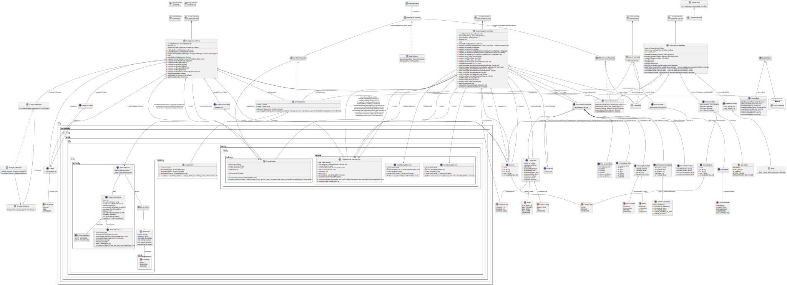

# Design notes

## Class diagram

A more or less complete UML class diagram of Gaai can be found below.

## Dependency Injection

The dependency injection implementation is based on the course  
[Add repository and Manual Dependency Injection](https://developer.android.com/codelabs/basic-android-kotlin-compose-add-repository?continue=https%3A%2F%2Fdeveloper.android.com%2Fcourses%2Fpathways%2Fandroid-basics-compose-unit-5-pathway-2%23codelab-https%3A%2F%2Fdeveloper.android.com%2Fcodelabs%2Fbasic-android-kotlin-compose-add-repository#0).
This resulted in the use of repositories en containers.

- **GaaiApplication**
  - Keeps track of the `container` with the repositories to use.
  - Sets an instance of **DefaultAppContainer** as the `container` to use.
- **DefaultAppContainer**
  - Sets **OfflineDevicesRepository** and **NordicBleRepository** as the repositories to use.
- **OfflineDevicesRepository** sets the **DeviceDao** as the source for the data.
- **DeviceDao** accesses the **GaaiDatabase** as the source for the data.
- **NordicBleRepository** uses the
  [Kotlin BLE Library for Android](https://github.com/NordicSemiconductor/Kotlin-BLE-Library)
  to provide the data.

## Startup sequence diagram

This sequence diagram represents the actions on Gaai startup, including the dependency injection part:

- Android calls **GaaiApplication.onCreate**, which sets the actual **DefaultAppContainer** with the
  **OfflineDevicesRepository** and **NordicBleRepository** to use.
- Android calls **MainActivity.onCreate** which sets the **GaaiApp** composable as the content to use 
  together with **GaaiTheme** and a **Surface**. 
- Android calls **GaaiApp** (via **GaaiTheme** and a **Surface**)
  - **GaaiApp** calls **GaaiNavHost** and sets the **NavHostController**.
  - **GaaiNavHost** calls **NavHost** and sets up Navigation graph for the application.
    Destinations for the following screens are created
    - **HomeScreen**
    - **DeviceEntryScreen**
    - **DeviceDetailsScreen**
    - **BadgeListScreen**

    Each screen calls **AppViewModelProvider** which returns the correct **Viewmodel** for this screen
    setup with the **DefaultAppContainer** to use. 
    The following view models are created
    - **HomeViewModel**
    - **DeviceEntryViewModel**
    - **DeviceDetailsViewModel**
    - **BadgeListViewmodel**

