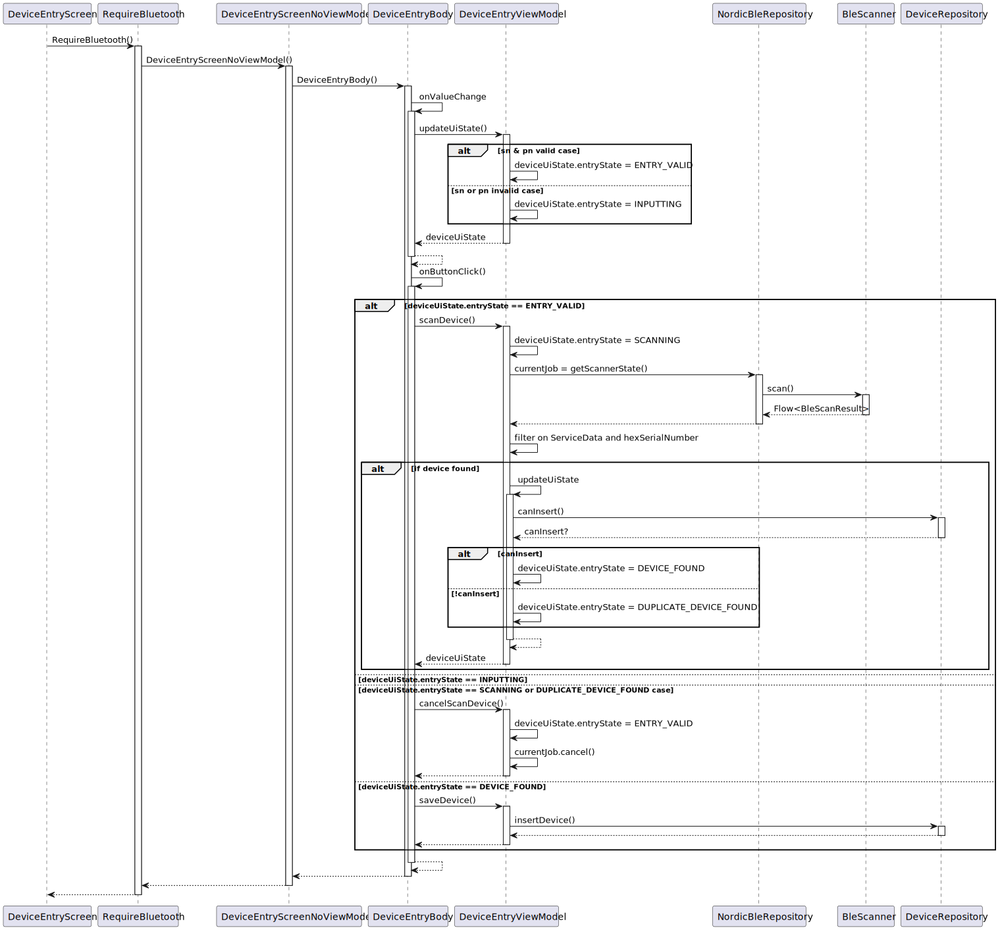
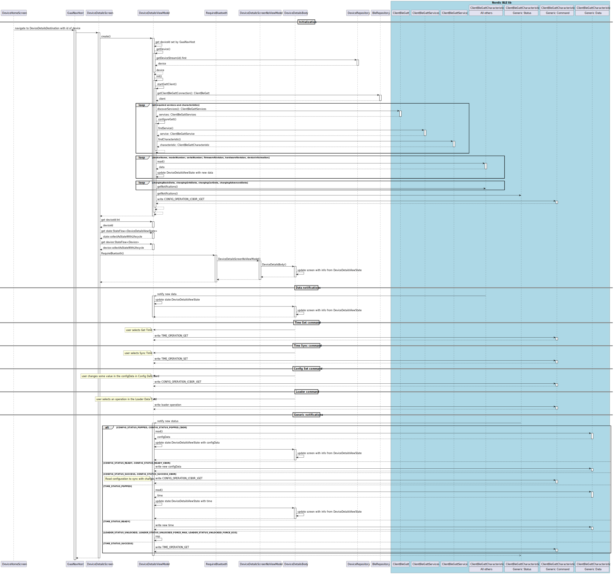

# Design notes

## Class diagram

A more or less complete UML class diagram of Gaai can be found below.

## Dependency Injection

The dependency injection implementation is based on the course  
[Add repository and Manual Dependency Injection](https://developer.android.com/codelabs/basic-android-kotlin-compose-add-repository?continue=https%3A%2F%2Fdeveloper.android.com%2Fcourses%2Fpathways%2Fandroid-basics-compose-unit-5-pathway-2%23codelab-https%3A%2F%2Fdeveloper.android.com%2Fcodelabs%2Fbasic-android-kotlin-compose-add-repository#0).
This resulted in the use of repositories en containers.

- **GaaiApplication**
  - Keeps track of the `container` with the repositories to use.
  - Sets an instance of **DefaultAppContainer** as the `container` to use.
- **DefaultAppContainer**
  - Sets **OfflineDevicesRepository** and **NordicBleRepository** as the repositories to use.
- **OfflineDevicesRepository** sets the **DeviceDao** as the source for the data.
- **DeviceDao** accesses the **GaaiDatabase** as the source for the data.
- **NordicBleRepository** uses the
  [Kotlin BLE Library for Android](https://github.com/NordicSemiconductor/Kotlin-BLE-Library)
  to provide the data.

## Startup sequence diagram

This sequence diagram represents the actions on Gaai startup, including the dependency injection part:

- Android calls **GaaiApplication.onCreate**, which sets the actual **DefaultAppContainer** with the
  **OfflineDevicesRepository** and **NordicBleRepository** to use.
- Android calls **MainActivity.onCreate** which sets the **GaaiApp** composable as the content to use 
  together with **GaaiTheme** and a **Surface**. 
- Android calls **GaaiApp** (via **GaaiTheme** and a **Surface**)
  - **GaaiApp** calls **GaaiNavHost** and sets the **NavHostController**.
  - **GaaiNavHost** calls **NavHost** and sets up Navigation graph for the application.
    Destinations for the following screens are created
    - **HomeScreen**
    - **DeviceEntryScreen**
    - **DeviceDetailsScreen**
    - **BadgeListScreen**

    Each screen calls **AppViewModelProvider** which returns the correct **Viewmodel** for this screen
    setup with the **DefaultAppContainer** to use. 
    The following view models are created
    - **HomeViewModel**
    - **DeviceEntryViewModel**
    - **DeviceDetailsViewModel**
    - **BadgeListViewmodel**

## Device Entry

The DeviceEntryScreen shows a PN and an SN Text field in which the user must enter the corresponding data of the 
Nexxtender charger.
The DeviceEntryViewModel computes a new DeviceUiState for each change of PN or SN.
DeviceUiState tracks amongst others
- DeviceDetails, including PN, SN, MAC, ...
- validity of PN and SN
- the EntryState

DeviceEntryScreen also shows an action button.
Label and action of the button depends on the Entry State.

### Device Entry state diagram

The state diagram for the EntryState is given in the next diagram.

The possible state are:

- `INPUTTING`: the user has not entered a valid SN and PN.
  This is the initial state.
  The button stays grayed out.
- `ENTRY_VALID`: the user has entered a valid SN and PN.
  The *Scan device* button becomes active.
- `SCANNING`: the device is scanning the BLE advertisements for a device that matches the specified SN.
  No such device is found yet.
  The *Cancel scanning* button becomes active.
- `DEVICE_FOUND`: a device with the specified SN was found while scanning and it does not exist yet
   in the apps database.
  The *Save* button becomes active.
- `DUPLICATE_DEVICE_FOUND`: a device with the specified SN was found while scanning but it already exists
  in the apps database.
  The *Cancel scanning* button becomes active.

The following transitions are defined

- In any state, changing PN or SN transitions the EntryState to `INPUTTING` or `ENTRY_VALID` depending on the PN and SN
  being valid or not.
- Pressing the *Scan device* button in the `ENTRY_VALID` EntryState transitions the state to `SCANNING`.
- Pressing the *Cancel scanning* button in the EntryState `SCANNING` or `DUPLICATE_DEVICE_FOUND` transitions 
  the state to `ENTRY_VALID`.
- Pressing the *Save* button in the `DEVICE_FOUND` EntryState saves the entry to persistent storage and 
  transitions to the final state.

### Device Entry sequence diagram

This sequence diagram represents the actions while creating a new device entry.

- The user types the "+" button in the **HomeScreen**. Gaai navigates to the  **DeviceEntryScreen**.
- **DeviceEntryScreen** calls  **DeviceEntryBody**
- **DeviceEntryBody** allows to enter the SN and PN of the device to connect to.
- **DeviceEntryBody** forwards SN and PN to the **DeviceEntryViewModel** in order to verify the SN and PN.
- If the user clicks the *Scan device* button,
  - **DeviceEntryBody** performs a *scanDevice()* on **DeviceEntryViewModel**
  - **DeviceEntryViewModel** sets the EntryState to `SCANNING`.
  - **DeviceEntryViewModel** will scan for all devices using **NordicBleRepository** and **BleScanner**.
    They will return a Flow of devices based on their advertisement messages.
  - **DeviceEntryViewModel** filters out the required device from the Flow, 
    based on a specific service data in the advertisement message and the device hexDecimalNumber 
    (which is based on the SN)
  - If a matching device is found,
    **DeviceEntryViewModel** determines if the found device already exists in the **DeviceRepository**.
    If the device already exists, the EntryState is set to `DUPLICATE_DEVICE_FOUND`
    Otherwise the EntryState is set to `DEVICE_FOUND` and the *Save* button becomes active.
- if the user clicks the *Cancel Scanning*, 
  the job executing the scanning is cancelled and the EntryState is set to `ENTRY_VALID` 
- If the user clicks the *Save* button, 
  - **DeviceEntryBody** performs a *saveDevice()* on **DeviceEntryViewModel**.
  - **DeviceEntryViewModel** performs a *insertDevice()* on **DeviceRepository.**.
  - **DeviceEntryBody** navigates back.

## BleRepository design

BleRepository.getScannerState() returns a flow of BleScanResult items.
BleScanResult is part of the Nordic Semiconductor Kotlin-BLE-Library.
The BleRepsoitory should hide the library for the rest of the Gaai app;
currently that is not the case.

It would be better that
- getScannerState() returns a flow of DeviceDetails().
- getScannerState() includes the filtering on the Flow<BleScanResult> that is currently done in  
  DeviceEntryViewModel.scanDevice. 
- getScannerState() would get an argument : serialNumber or hexSerialNumber or DeviceDetails
- getScannerState() would be renamed to scanDevice(hexSerialNumber:UInt) : Flow<DeviceDetails>
  or scanDevice(deviceDetails:DeviceDetails) : Flow<DeviceDetails>

## Device Details

The DeviceDetailsScreen shows all the details for a chosen Nexxtender device.
Some of the data comes from the DevicesRepository that stores permanent data, 
others come from the BleRepository that obtains data from the Nexxtender device using a BLE connection.

### Device Details sequence diagram

This sequence diagram represents the actions while viewing the details of a device entry.

- The user selects a device in the **HomeScreen**. 
  Gaai navigates via the **GaaiNavHost** to the  **DeviceDetailsScreen**
  with the id of the selected device set in the **DeviceDetailsViewModel**

# DeviceDetails versus Device
be.cuypers_ghys.gaai.data.Device is a data class designed with database @ tags to define database.
be.cuypers_ghys.gaai.ui.device is a data class of rhandling the device elsewhere.
I made them seperate as I was not sure if I could use Device also outside teh Room domain without problems.
But both classes are identical, except for the database tags, so I should be able to use them.