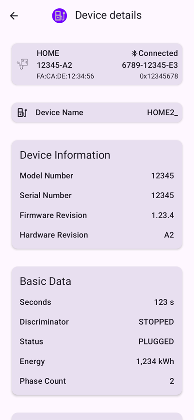
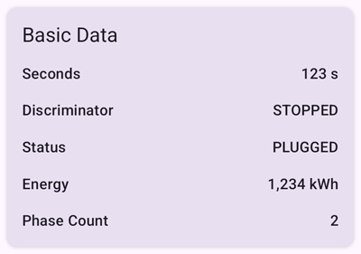
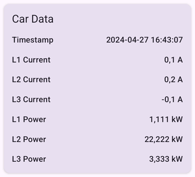
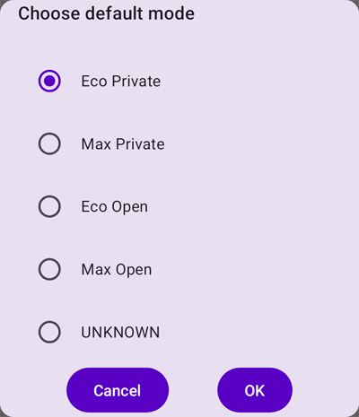
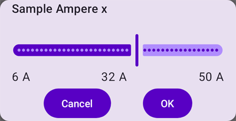
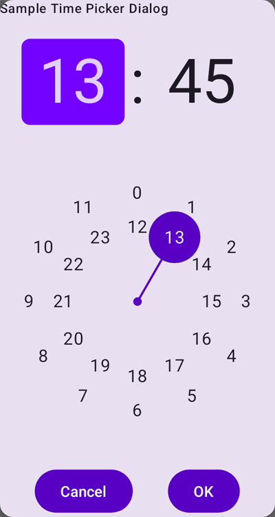

# Nexxtender Home android app

The goal of this app is to control the *Nexxtender Home* charger without requiring the
[Android Nexxtmove](https://play.google.com/store/apps/details?id=com.powerdale.nexxtender) app.
The Android Nexxtmove app is the official app for controlling the *Nexxtender Home* charger and for syncing
billing information to the [Nexxtmove.me](https://www.nexxtmove.me/) website for refunding.
Both the Nexxtmove app and the Nexxtmove.me website require a username and password to login.
Without it, it is impossible to use the Nexxtmove app and therefore impossible to operate the *Nexxtender* Home charger,
which has no UI or input device on its own.
If you no longer have a valid username and password for the Nexxtmove app, using *Gaai* is an option.
Other alternatives are

- [ESPHome BLE Client for Powerdale Nexxtender EV Charger](https://github.com/geertmeersman/nexxtender)
- [Nexxtender Home Bluetooth Controller](https://github.com/toSvenson/nexxtender-ble)
- [NEXXTLOOK](https://www.lookwatt.be/drupal/web/nexxtlook)

## Gaai?

Choosing a short distinctive name for a project is always difficult.
A bird name was chosen.
[Gaai](https://nl.wikipedia.org/wiki/Gaai) is Dutch for the
[Eurasian jay](https://en.wikipedia.org/wiki/Eurasian_jay).

# Features

- Only requires to install *Gaai*.
- No additional hardware required.
- No www.Nexxtmove.me account required.
- Connects over [Bluetooth Low Energy (BLE)](https://en.wikipedia.org/wiki/Bluetooth_Low_Energy) to the
  *Nexxtender Home*.
- Finds and connects to the device based on its PN and SN. No MAC required.
- Shows real time data from the *Nexxtender Home*: device information, charging status, current, power consumption, ...
- Allows to control the *Nexxtender Home*: start and stop the charger in ECO or MAX mode,
  sync the time with the mobile phone.
- Allows to configure the *Nexxtender Home*: default charging mode, max grid and max device current, off-peak hours.
- Remembers the PN and SN of multiple devices.

The following features are **not** available:

- Synchronization with the www.Nexxtmove.me website from Diego.
- Management of badges (add, delete).
- Download of Events, Metrics, charging information for billing, CDR, CCDT, ...
- Firmware upload.

# Installing Gaai

There are 3 ways to install *Gaai* on your Android phone:

1. [Install Gaai using APK file](#install-gaai-using-apk-file)
2. [Install Gaai using Android Studio on Windows](#install-gaai-using-android-studio-on-windows)
3. [Install Gaai using Google Play Store](#install-gaai-using-google-play-store)

## Install Gaai using APK file

For most people, this is the preferred way of installing.

An APK file generated from *Gaai* can be installed as described in
[How to install third-party apps without the Google Play Store](https://www.androidauthority.com/how-to-install-apks-31494/).

*Gaai* APK files are available for the official
[releases](https://github.com/FrankHJCuypers/Gaai/releases) in the GitHub repo.
Select a release, open its *assets* and select the APK file.

If the selected APK is a `-debug` version, it will install without questions.
If it is a `-release` version, it is signed with the Gaai signature key and Android will perform some tests.
If *Google Play Protect* recommends to scan the app, select "scan app" and wait for the scanning to complete.
If the scanning is complete, select "Install app".

## Install Gaai using Android Studio on Windows

*Gaai* can be installed on your Android phone using Android Studio.
See [Environment setup](DEVELOPMENT.md#environment-setup).
Only used by developers during development.

## Install Gaai using Google Play Store

Once *Gaai* is sufficiently stable, distributing it via Google Play Store is an option to consider.
For the moment it is not available.

# Getting Started

## Bluetooth

*Gaai* uses BLE to connect to the *Nexxtender Home*,
so make sure that Bluetooth is enabled on your mobile device.

In addition, *Gaai* requires some Bluetooth related permissions in order to function.
When *Gaai* is ran for the first time, it will ask for the required permissions.
In that case, please press the "Request permissions" button, and then press "Allow".
If you press "Don't Allow", *Gaai* will insist that it needs the permissions to continue,
but recent Android versions only allow an app to ask only once for permissions.
The only way out in that case is to go to Android Settings -> Apps -> Gaai -> Permissions.
In the "Not Allowed" section you will find the permission "Nearby devices":
click on it and press "Allow". You now have granted the permission.

Depending on the Android version, the following permissions are required:

+ Up to and including Android 11 (SDK <= 30): `android.permission.ACCESS_FINE_LOCATION`
+ Starting from Android 12 (SDK >= 31): `android.permission.BLUETOOTH_SCAN` and `android.permission.BLUETOOTH_CONNECT`

Note that permission naming is confusing in Android!
Although the *Gaai* application code asks for the permissions `BLUETOOTH_SCAN` and `BLUETOOTH_CONNECT`
in Android 12 and up:

+ The Android pop-up where you have to allow the permissions, will ask
  "Allow *Gaai* to find, connect to, and determine the relative position of nearby devices."
+ In Android Settings -> Apps -> Gaai -> Permission the permission is named
  "Nearby Devices permission".

## Bluetooth pairing

The first time that *Gaai* connects to a *Nexxtender Home* device,
*Gaai* will show a pop-up asking to enter the 6-digit PIN.
After entering the PIN, pairing completes.

See [PIN value](#pin-value) for the PIN value.

If the mobile phone user later removes the *Nexxtender Home* device from the "Bluetooth" menu in Android,
the pairing information is lost and *Gaai* will not automatically open the pairing dialog again.
The only options to restore from this situation are either of:

- pair the device from the Android "Bluetooth menu".
- delete the *Nexxtender Home* from *Gaai* and then add it again.
  *Gaai* will now again ask to pair.

### PIN value

The Nexxtender Home charger installer that installed your charger and connected it with the Nexxtmove app on your
mobile phone, has paired it with the Nexxtender Home using the correct PIN value.
In general, the installer will not have provided you with that PIN value.
As long as you use the same mobile phone to connect to the Nexxtender Home, both devices should stay paired and
there is no issue.
But when you need to move to another phone, you need the PIN value.
If you don't have the PIN code, you can provide the *Gaai* GitHub repository owner with the PN and SN values
as mentioned in [Add a Nexxtender Home device](#add-a-nexxtender-home-device)
and he will calculate it for you.

## First start

When *Gaai* is started the first time, it has no *Nexxtender Home* devices in its database yet.
*Gaai* will display a home screen like the following:

At the bottom right is a button with a "+" that allows to add a *Nexxtender Home* device.

## Add a Nexxtender Home device

When tapping the "+" in the home screen, the following dialog box appears:

The *Scan device* button stays grayed out until a valid PN and SN are entered.
The PN and SN of your *Nexxtender Home* can be found at the bottom of your device,
as is shown in

.

When a valid PN and SN are entered, the *Scan Device* button become active.

Make sure that you are close to the *Nexxtender Home* and that no other device is connected with it over BLE.
Tap the *Scan Device* button. Scanning will start and the button will now show *Cancel Scanning* allowing you to
cancel the scan if it takes to long.

If you entered the correct PN and SN,
*Gaai* should find the *Nexxtender Home* in less then a few seconds and show the following screen.

Gaai shows a card with the details of the found device.

+ At the top left is the PN.
+ At the top right is the SN.
+ At the bottom left is the MAC.
+ At the bottom right is the Service Data used to find the BLE device based on its advertisement packet.

Press *Save* to save this device in *Gaai's* database.
This will bring you back to the previous screen, now showing one device.

If the device that you scanned was already in *Gaai's* database, you will see

*Gaai* will not let you create duplicates.

## List of Devices

As soon as the database contains at least one device, *Gaai* shows a list of all registered devices at startup as
shown in the next picture.

In this screen you can

+ Add another device by clicking on the "+" button at the bottom right.
+ Remove a device by swiping its card to the right.
+ Connect to the device by clicking on its card.
  This will open the [Device details](#device-details) screen.
  Make sure that you are close to the *Nexxtender Home* and that no other device is connected with it over BLE.

## Device details

When clicking on a device card in [List of Devices](#list-of-devices),
*Gaai* tries to connect to the device and shows the following screen.

The complete screen is larger then the phone's screen.
You must scroll up to see the other parts.
When the screen opens, only the labels are shown without data values.
The values are populated as soon as *Gaai* has established the connection and read all the data.
That can take 5 seconds.
If no data appears after a few seconds,
it might be that another BLE client is still connected to the device.
It could also be a problem in *Gaai*.
It is normally solved by going back to the previous screen using the left arrow at the top left of the screen,
and try again.

The card on the top is the same one as from the [List of Devices](#list-of-devices).

The next cards show the device name and the Device Information.
These contain general BLE information, not specific for *Nexxtender Home*.

The next cards contain specific *Nexxtender Home* information as reported by the device.

### Basic Data

The Basic Data card shows Basic *Nexxtender Home* charging data.

### Grid Data

The Grid Data card shows Grid Data as measured by the *Nexxtender Home*.

### Car Data

The Car Data card shows Car Data as measured by the *Nexxtender Home*.

### Advanced Data

The Advanced Data card shows Advanced Data as measured by the *Nexxtender Home*.

### Configuration

The Configuration card shows the data that can be configured in the *Nexxtender Home*.

The fields "Min Device" and "iCapacity" are only shown when the Nexxtender Home firmware version is at least 3.50.
The fields "Max Device" and "Network Type" are only shown when the Nexxtender Home firmware version is at least 1.1.0.
In theory all these fields are configurable and can be changed.
*Gaai* only allows to change the fields marked with .
For the fields "Safe" and "Network Type" *Gaai* does not implement the option to change the values,
as it is probably not wise to change these values if you don't know what you are doing.
Changing the values of "Min Device" and "iCapacity" is also not supported by *Gaai*;
it is insufficiently clear what they are and if it is safe to change them.

Clicking on  next to "Default mode" gives the following dialog screen:

Select the required default charging mode and press OK to confirm.
OK is grayed out if the choice is still "Unknown".
Pressing Cancel does not change anything.

Clicking on  next to "Max Grid" or "Max Device"
gives the following dialog screen:

Select the required current value in Amperes using the slider and press OK to confirm.
Pressing Cancel does not change anything.

Clicking on  next to "Weekdays" or "Weekend"
gives the following dialog screen:

Change both Start and End times by clicking  next to it.
A time picker dialog opens to select a time:

After changing the Start and End times, press OK to confirm.
Pressing Cancel does not change anything.

### Time

The Time card allows to sync the time of the *Nexxtender Home* with the time on the phone.

Clicking "Get Time" reads the current time from the *Nexxtender Home*.

Clicking "Sync Time" writes the current phone time to the *Nexxtender Home*.

### Loader

The Loader card allows to start or switch the *Nexxtender Home* to charge in a specific mode or to stop it.

Click on a button and the *Nexxtender Home* immediately switches to the corresponding state.

# Links

Useful information can be found at

- [Nexxtender Home Information, Frank HJ Cuypers](https://github.com/FrankHJCuypers/Gaai/wiki/Nexxtender-Home-Information)
- [ESPHome BLE Client for Powerdale Nexxtender EV Charger](https://github.com/geertmeersman/nexxtender)
- [Nexxtmove for Home Assistant](https://github.com/geertmeersman/nexxtmove)
- [Nexxtender Home Bluetooth Controller](https://github.com/toSvenson/nexxtender-ble)
- [Discord chat](https://discord.gg/PTpExQJsWA) related to
  [ESPHome BLE Client for Powerdale Nexxtender EV Charger](https://github.com/geertmeersman/nexxtender)
  and [Nexxtmove for Home Assistant](https://github.com/geertmeersman/nexxtmove)

# License

This project is licensed under the GNU AGPLv3 License. See the [LICENSE](LICENSE) file for details.

# Acknowledgements

- [ESPHome BLE Client for Powerdale Nexxtender EV Charger](https://github.com/geertmeersman/nexxtender)
  showing how to address the Nexxtender Home.
- [NordicSemiconductor Kotlin-BLE-Library uiscanner](https://github.com/NordicSemiconductor/Kotlin-BLE-Library/tree/main/uiscanner)
  for the BLE library.

# Supported Android versions and Nexxtender Home firmware versions

In theory *Gaai* should work from API 26 (Android 8) and higher, but these are not all tested.
For the Nexxtender Home firmware versions,
there is insufficient documentation available to assess if it will work for older versions.

The following table shows the version combinations for which it was confirmed that it works.
Basic scenarios seems to work, but further testing is required for other scenarios.
The first row is the main combination used for testing and debugging during development.
The other rows are confirmed by other users.

| Phone Model        | Android API (version) | Nexxtender Home firmware version |
|--------------------|-----------------------|----------------------------------|
| Google Pixel 6 Pro | 34 (14)               | 2.53.2                           |
| Google Pixel 8 Pro | 35 (15)               | 2.53.2                           |
| Nokia X10          | 34 (14)               | 2.53.2                           |
| OnePlus Nord 2     | 33 (13)               | 3.65.0                           |

There are currently no combinations for which it is confirmed that it does not work.

# Disclaimer

The developer

- has no link with Powerdale nor Diego.
- developed this app without prior knowledge of most of the components and tools used
  developing it: Android app development, Android Studio, Gradle, Kotlin, Jetpack compose, BLE, ...
- did not see any perturbing interactions with the *Nexxtmove* app.
  However, if you still need the *Nexxtmove* app to upload charging information (for reimbursement or others),
  be very careful as there is no guarantee that it will not interfere.

*Gaai* is only tested on a the phone versus Nexxtender Home versions as indicated in section

At this point *Gaai* should be considered an alpha app, for trials only.
It is currently not tested on sufficient combinations,
so please expect to spend the necessary debugging time.
If despite the preceding warnings, you decide to use *Gaai*, that is on your own responsibility.
But we will do our best to help you. 

